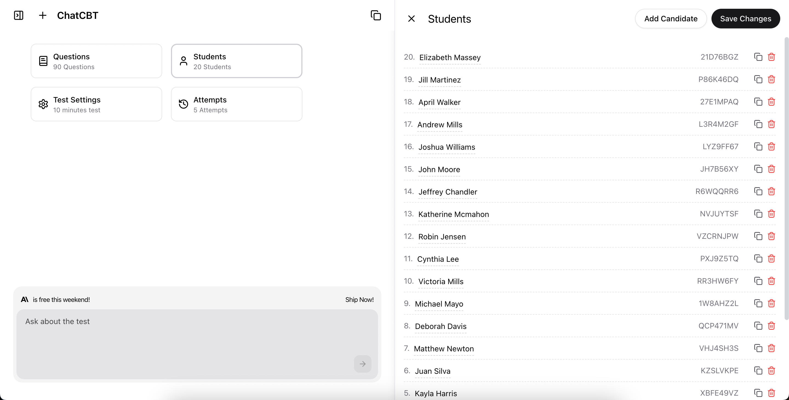
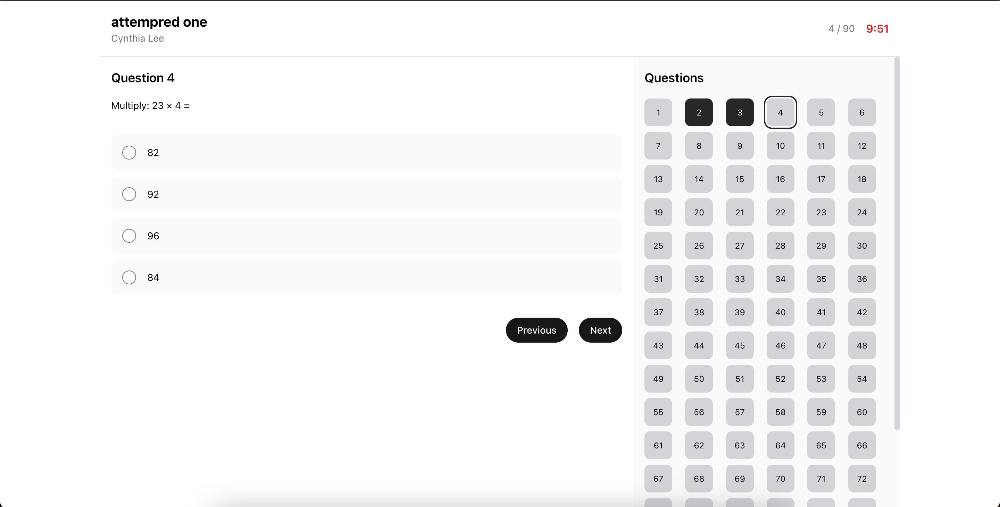

# ChatCBT

ChatCBT is an intelligent platform that helps educators and organizations create and manage online tests. Think of it as a smart assistant for making exams: you can provide materials like documents or text, and our AI will help generate questions. It's built to be secure and easy for everyone to use, whether you're a teacher setting up a quiz or a student taking a test.



## Key Features

- **AI-Powered Question Generation:** Automatically generate test questions from various sources, including text, PDFs, and other documents.
- **Secure Testing Environment:** Features anti-cheating measures such as tab switch detection and fullscreen exit monitoring to ensure test integrity.
- **Customizable Tests:** Create tests with custom titles, descriptions, and time limits.
- **Student Management:** Easily manage student lists for each test, with support for bulk student uploads via CSV.
- **Real-time Attempt Monitoring:** Track student attempts in real-time, including scores, submission times, and anti-cheating flags.
- **Intuitive User Interface:** A clean and modern UI built with Next.js and Tailwind CSS for a seamless user experience.



## Tech Stack

- **Framework:** [Next.js](https://nextjs.org/)
- **Language:** [TypeScript](https://www.typescriptlang.org/)
- **Database:** [PostgreSQL](https://www.postgresql.org/) with [Prisma](https://www.prisma.io/)
- **Authentication:** [Supabase](https://supabase.io/)
- **Styling:** [Tailwind CSS](https://tailwindcss.com/)
- **AI:** [Google Gemini](https://ai.google.dev/)
- **State Management:** [React Query](https://tanstack.com/query/v5)
- **Form Handling:** [React Hook Form](https://react-hook-form.com/)
- **File Parsing:** [Papaparse](https://www.papaparse.com/), [XLSX](https://sheetjs.com/)

## Getting Started

To get a local copy up and running, follow these simple steps.

### Prerequisites

- Node.js (v20 or later)
- Yarn or npm
- A PostgreSQL database
- A Supabase project for authentication

### Installation

1. **Clone the repository:**
   ```sh
   git clone https://github.com/your-username/chat-cbt.git
   cd chat-cbt
   ```

2. **Install dependencies:**
   ```sh
   npm install
   # or
   yarn install
   ```

3. **Set up environment variables:**
   Create a `.env` file in the root of the project and add the following environment variables:
   ```env
   DATABASE_URL="your-postgresql-database-url"
   DIRECT_URL="your-postgresql-direct-database-url"
   NEXT_PUBLIC_SUPABASE_URL="your-supabase-project-url"
   NEXT_PUBLIC_SUPABASE_ANON_KEY="your-supabase-anon-key"
   GEMINI_API_KEY="your-google-gemini-api-key"
   ```

4. **Run database migrations:**
   ```sh
   npx prisma migrate dev
   ```

5. **Run the development server:**
   ```sh
   npm run dev
   ```

Open [http://localhost:3000](http://localhost:3000) with your browser to see the result.

## Project Structure

The project is organized into the following directories:

- `src/app`: Contains the application's pages and API routes.
- `src/components`: Contains reusable React components, organized by feature and UI elements.
- `src/lib`: Contains shared libraries and utility functions, including API clients, database configuration, and security helpers.
- `src/services`: Contains services for interacting with external APIs and handling business logic.
- `prisma`: Contains the Prisma schema and database migration files.
- `public`: Contains static assets, such as images and fonts.

## License

This project is licensed under the MIT License. See the `LICENSE` file for more information.
